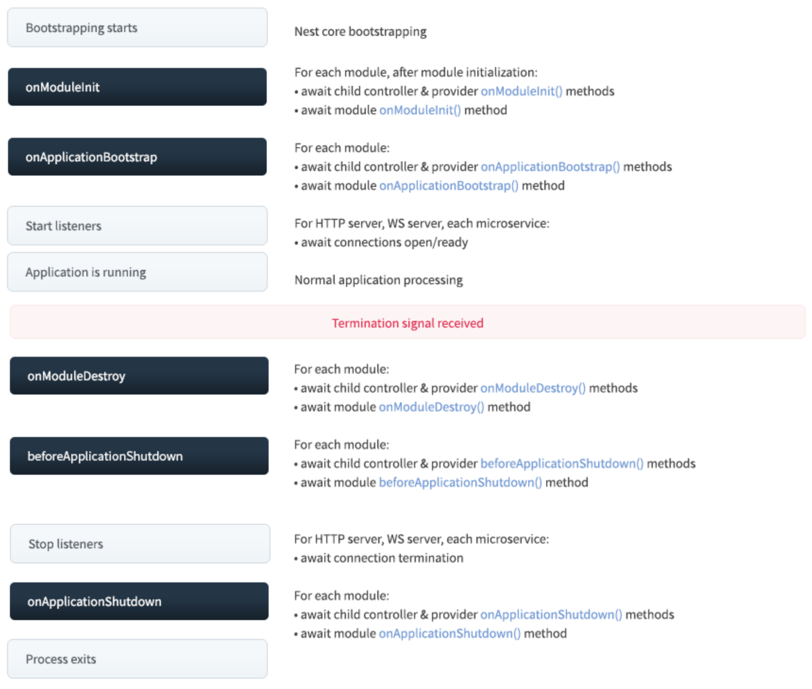

# 生命周期

Nest 应用以及每个应用元素都有一个由 Nest 管理的生命周期。Nest 提供了生命周期钩子，可以让你了解关键生命周期事件，并能够在事件发生时采取行动（在模块、提供程序或控制器上运行注册代码）。

## 生命周期顺序

下图描述了关键应用生命周期事件的顺序，从应用启动到节点进程退出。我们可以将整个生命周期分为三个阶段：初始化、运行和终止。使用此生命周期，你可以规划模块和服务的适当初始化、管理活动连接并在收到终止信号时优雅地关闭你的应用。


## 生命周期事件

生命周期事件发生在应用启动和关闭期间。Nest 在以下每个生命周期事件中调用模块、提供程序和控制器上已注册的生命周期钩子方法（需要首先启用关闭钩子，如 below 中所述）。如上图所示，Nest 还会调用相应的底层方法来开始监听连接和停止监听连接。

当你显式调用 app.close() 或进程收到特殊系统信号（例如 SIGTERM）并且你在应用引导时正确调用了 enableShutdownHooks时，才会触发 onModuleDestroy、beforeApplicationShutdown 和 onApplicationShutdown。

生命周期钩子方法	                    生命周期事件触发钩子方法调用
onModuleInit()	                    一旦解决了主机模块的依赖，就会调用。
onApplicationBootstrap()	        一旦所有模块都已初始化，但在监听连接之前调用。
onModuleDestroy()*	                在收到终止信号（例如 SIGTERM）后调用。
beforeApplicationShutdown()*	    在所有 onModuleDestroy() 处理程序完成后调用（Promise 已解决或拒绝）；一旦完成（Promise 已解决或拒绝），所有现有连接将被关闭（app.close() 被调用）。
onApplicationShutdown()*	        在连接关闭后调用（app.close() 解析）。

## 用法

每个生命周期钩子都由一个接口表示。接口在技术上是可选的，因为它们在 TypeScript 编译后不存在。尽管如此，使用它们以从强类型和编辑器工具中获益是一种很好的做法。要注册生命周期钩子，请实现适当的接口。例如，要在特定类（例如 Controller、Provider 或 Module）的模块初始化期间注册要调用的方法，请通过提供 onModuleInit() 方法来实现 OnModuleInit 接口，如下所示：

```ts
import { Injectable, OnModuleInit } from '@nestjs/common';

@Injectable()
export class UsersService implements OnModuleInit {
  onModuleInit() {
    console.log(`The module has been initialized.`);
  }
}
```

## 异步初始化

OnModuleInit 和 OnApplicationBootstrap 钩子都允许你推迟应用初始化过程（返回 Promise 或将方法标记为 async，await 在方法主体中标记为异步方法完成）。

async onModuleInit(): Promise<void> {
  await this.fetch();
}

## 应用关闭

onModuleDestroy()、beforeApplicationShutdown() 和 onApplicationShutdown() 钩子在终止阶段被调用（以响应对 app.close() 的显式调用或接收到系统信号，例如 SIGTERM，如果选择加入）。

关机钩子监听器会消耗系统资源，因此默认情况下它们是禁用的。要使用关闭钩子，你必须通过调用 enableShutdownHooks() 来启用监听器：

import { NestFactory } from '@nestjs/core';
import { AppModule } from './app.module';

async function bootstrap() {
  const app = await NestFactory.create(AppModule);

  // Starts listening for shutdown hooks
  app.enableShutdownHooks();

  await app.listen(3000);
}
bootstrap();


当应用接收到终止信号时，它将调用任何已注册的 onModuleDestroy()、beforeApplicationShutdown()，然后是 onApplicationShutdown() 方法（按上述顺序），并将相应的信号作为第一个参数。如果注册的函数等待异步调用（返回 promise），Nest 将不会继续序列，直到 promise 被解决或拒绝。


@Injectable()
class UsersService implements OnApplicationShutdown {
  onApplicationShutdown(signal: string) {
    console.log(signal); // e.g. "SIGINT"
  }
}

调用 app.close() 并不会终止 Node 进程，只会触发 onModuleDestroy() 和 onApplicationShutdown() 钩子，所以如果有一些间隔、长时间运行的后台任务等，进程不会自动终止。